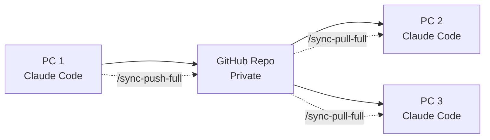

# Claude Context Sync (Windows Fork)

**Seamlessly sync your Claude Code context and data across multiple PCs using GitHub**

[](https://opensource.org/licenses/MIT)

> Windows-compatible fork of [shaike1/claude-sync](https://github.com/shaike1/claude-sync). Works on Windows, macOS, and Linux.

## What This Solves

Using Claude Code on multiple PCs? Tired of manually copying `CLAUDE.md` files between machines? This tool automatically syncs your entire Claude Code experience across all your devices.

## Features

### Essential Sync
- **`CLAUDE.md`** - Your project contexts
- **Claude Settings** - Preferences and configurations
- **Conversation Sessions** - Complete chat history
- **MCP Configurations** - Server setups and integrations
- **Todo Lists** - Task tracking data

### Full Sync (Everything)
- All essential items **PLUS**:
- **Shell Integration** - Custom shell snapshots
- **Slash Commands** - Your custom Claude commands
- **Complete User Profile** - Every setting preserved

## Prerequisites

- **Python 3** (`python` or `python3` on your PATH)
- **Git** with credentials configured
- **Windows**: Run commands in **Git Bash** (comes with [Git for Windows](https://gitforwindows.org/)) or **WSL**. CMD and PowerShell are not supported for the installer.
- **macOS/Linux**: Any terminal works.

## One-Line Installation

### Basic Context Sync
```bash
curl -sSL https://raw.githubusercontent.com/zhangyu-econ/claude-sync-windows/main/install.sh | bash -s -- https://github.com/YOUR_USERNAME/YOUR_REPO
```

### Full Data Sync (Recommended)
```bash
curl -sSL https://raw.githubusercontent.com/zhangyu-econ/claude-sync-windows/main/install-full.sh | bash -s -- https://github.com/YOUR_USERNAME/YOUR_REPO full
```

## Quick Setup

### 1. Create GitHub Repository
1. Go to [GitHub](https://github.com/new)
2. Create a **private** repository (e.g. `claude-sync`)
3. Don't initialize with README

### 2. Install on First PC
```bash
# Replace with your GitHub username
curl -sSL https://raw.githubusercontent.com/zhangyu-econ/claude-sync-windows/main/install-full.sh | bash -s -- https://github.com/YOUR_USERNAME/claude-sync full
```

### 3. Install on Other PCs
Run the same command on all other machines - they'll sync automatically!

### 4. Start Using
- Use `/sync-push-full` to upload your data
- Use `/sync-pull-full` to download from other PCs
- Use `/sync-full` for bidirectional sync

## Available Slash Commands

After installation, these commands are available in Claude Code:

| Command | Description |
|---------|-------------|
| `/sync-pull` | Pull basic context from GitHub |
| `/sync-push` | Push basic context to GitHub |
| `/sync-pull-full` | Pull ALL Claude data (sessions, settings, MCP) |
| `/sync-push-full` | Push ALL Claude data |
| `/sync-full` | Complete bidirectional sync |
| `/sync-status` | Show sync configuration and status |

## Architecture



## How It Works

1. **Local Changes**: Edit your `CLAUDE.md` or use Claude Code normally
2. **Push Changes**: `/sync-push-full` uploads your data to GitHub
3. **Pull Updates**: `/sync-pull-full` on another PC downloads everything
4. **Smart Merging**: Conflicts are resolved automatically
5. **Session Continuity**: Continue conversations from any PC

## What Gets Synced

### Essential Level
- Project contexts (`CLAUDE.md`)
- Claude settings (`~/.claude.json`)
- All conversation sessions (`~/.claude/projects/`)
- MCP server configurations
- User preferences (`~/.claude/settings.local.json`)
- Todo lists (`~/.claude/todos/`)

### Full Level
- Everything from Essential
- Shell integration (`~/.claude/shell-snapshots/`)
- Custom slash commands (`~/.claude-code/slash-commands/`)

## Security & Privacy

- **Private Repository**: All data stored in your private GitHub repo
- **No Credentials Stored**: Uses your existing Git configuration
- **Selective Sync**: Choose essential or full sync levels
- **Encrypted Transit**: All data encrypted via HTTPS
- **Machine Identification**: Each PC gets a unique, anonymous ID

## Manual Installation

If you prefer manual setup:

```bash
# 1. Download the sync scripts
curl -o ~/claude-sync.py https://raw.githubusercontent.com/zhangyu-econ/claude-sync-windows/main/claude-sync.py
curl -o ~/claude-sync-extended.py https://raw.githubusercontent.com/zhangyu-econ/claude-sync-windows/main/claude-sync-extended.py

# 2. Configure your repository
python ~/claude-sync-extended.py setup --git-repo https://github.com/USERNAME/claude-sync.git --level full

# 3. Create slash commands (see install script for details)
mkdir -p ~/.claude-code/slash-commands
```

## Windows Notes

This fork includes the following changes for Windows compatibility:

- Uses `socket.gethostname()` instead of `os.uname()` (not available on Windows)
- Uses `USERNAME` environment variable instead of `os.getuid()` (not available on Windows)
- Installer auto-detects `python` vs `python3` (Windows typically uses `python`)
- Slash commands use `python` by default

The scripts also work on macOS and Linux.

## Troubleshooting

### Repository Access Issues
```bash
# Ensure Git is configured
git config --global user.name "Your Name"
git config --global user.email "your.email@example.com"

# Test repository access
git clone https://github.com/USERNAME/claude-sync.git
```

### Sync Conflicts
```bash
# Check sync status
/sync-status

# Force clean sync
cd ~/.claude-sync/data/repo
git reset --hard origin/main
/sync-pull-full
```

### Missing Dependencies
```bash
# Ensure Python 3 is available
python --version   # Windows
python3 --version  # macOS/Linux

# Check Git installation
git --version
```

## License

MIT License - see [LICENSE](LICENSE) for details.

## Acknowledgments

- **[shaike1/claude-sync](https://github.com/shaike1/claude-sync)** - Original project
- **Anthropic** - For creating Claude Code

---

**Made with care for the Claude Code community**
